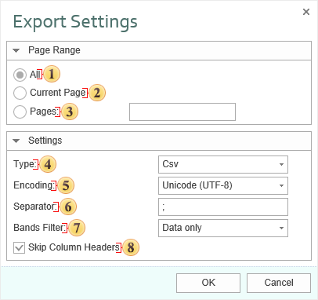

## Data

This is a group of file formats which are used to store table data. Export options in **Data**:

 The checkbox **All** enables processing of all report pages.

 The checkbox **Current Page** enables processing only the current (selected) report page.

 The checkbox **Pages** has the field. This field specifies the number of pages to be processed. You can specify a single page, several pages (using a comma as the separator) and also specify a range by defining the start page and end page range separated with "-". For example, 1,3,5-12.

 The parameter **Type** provides the ability to determine a type of the file the report will be converted into.

> **Information**
>
> Information:Depending on the file type, parameters, and their number may vary. For example, when you select a format DIF or Sylk, the following options will be available:
>
> The option **Data Only** enables/disables the mode of exporting data only. If this option is enabled, information will be exported from the Data bands (the component table, Hierarchical band). Only these bands are processed, the rest are ignored. If this option is disabled, the entire report will be exported;
>
> The option **Use Default System Encoding** allows you to use the system encoding by default. Different encoding can be applied depending on the installed system. If this option is disabled, you must set the encoding by the standard.

 The parameter **Encoding** is used to define file encoding.

 The parameter **Separator** specifies delimiter between the data in the CSV file.

 The parameter **Bands Filter** is used to apply a filtering condition in the export. The following options are available:

  * **Data Only** - in this case only Data bands will be processed (the Table component, Hierarchical band);

  * **Data and Headers/Footers** - Data bands will be processed (the Table component, Hierarchical band), and their headers/footers, if any;

  * **All Bands** - all bands of the report will be processed.

 The checkbox **Skip Column Headers** enables/disables the column headers. If the option is enabled, then column headers will not be displayed. If this option is disabled, then column headers (if present in the report) will be displayed.

**CSV** (Comma Separated Values) is a text format that is used to represent table data. Each string of the file is one row of the table. The values of each column are separated by the delimiter that depends on regional settings. The values that contain reserved characters (such as a comma or a new string) are framed with the double quotes ( ") symbol; if double quotes are found in the value they are represented as two double quotes in the file.

> **Information**
>
> Only those data (components) can be exported to the CSV format which are placed on data bands. If the SkipColumnHeaders property is set to false then, additionally, column headers are exported as the first row.

**Controlling Exports**

The **Tag** property of each textbox in a Data band can be specified with the following elements that control the export:

Export Type : "**FieldName**"

Column: "**FieldName**" "**DataRow**"

Several elements should be separated with the semicolon.

The "**Export Type**" element indicates for which export the field name is set. The values can be used: “dbf”, “csv”, “xml”, “default”. The "FieldName" element indicates the field name in the file. The own name can be specified to each type of export. If the name for each export is not specified then the name for the “default” type is taken. For example:

`DBF : "Describe" ; CSV : "Description" ; default: "Default name"`

The "**Column**" element indicates that additional field is added to exported data. The "FieldName" element indicated the name of a new field. The "DataRow" element indicates the content of a new field and can be an expression. For example:

`Column: "SortField" "{Products.Categories.CategoryName}"`

**DBF** (DataBase File) is the format to store data and it is used as the standard way to store and pass information. The DBF file consist of a header section for describing the structure of the data in the file. There are several variations on the .dbf file structure.

> **Information**
>
> Only data can be exported to the DBF format, in other words only the components, which are placed on data bands.

**Controlling Exports**

The following elements can be specified in the Tag property to control export:

DataType [ : FieldLength [ : DecimalPartLength ] ]

ExportType : "**FieldName**"

Column: "**FieldName**" "**DataString**"

Several elements should be separated with the semicolon. The “DataType" element should be only one and should be placed first, other elements – if necessary.

Values of the "**DataType**" element are shown in the table below. If the data type is not set, then the string data type is taken by default. The "FieldLength" element sets fixed width of a data field. If the field width is not set, then the width is taken from the table. For the string type the default width is the longest string. The "**DecimalPartLength**" element sets the number of characters after comma. If it is not set, then the default number is taken.

Data type

DBF data type

(default size)

Description

int

Numeric (15 : 0)

Numeric

long

Numeric (25 : 0)

Numeric

float

Numeric (15 : 5)

Decimal

double

Numeric (20 : 10)

Decimal

string

Character (auto)

Text

date

Date (8)

Date

Sample of using elements are shown in the table below.

**Type**

**Description**

string : 25

set the column width (25 characters) and cuts all long strings

float

converts decimal digit with the length 15 characters, 5 characters after comma

float :10

converts decimal digit with the length 10 characters,  5 characters after comma

float :10 : 2

converts decimal digit with the length 10 characters, 2 characters after comma

int :10 : 2

converts integer digit with the length 10 characters; the second parameter is ignored

> **Information**
>
> If the integer part of a digit is long and cannot be placed into the specified field, then it is cut, so data are lost. For example, if the write «-12345,678» in the «float:8:3» field, then the «2345,678» will be output.

The "**ExportType**" element indicates for which export the field name is set. The values can be used: “dbf”, “csv”, “xml”, “default”. The "**FieldName**" element indicates the field name in the file (for the DBF the is automatically cut up to 10 characters). The own name can be specified to each type of export. If the name for each export is not specified then the name for the “default” type is taken. For example:

`DBF : "Describe" ; XML : "Description" ; default: "Default name"`

The "**Column**" element indicates that the additional field is added to the exported data. The "**FieldName**" element indicates the name of a new field. The "**DataRow**" element indicates the content of a new field and can be expression. For example

`Column: "SortField" "{Products.Categories.CategoryName}"`

**XML** (eXtensible Markup Language) is a text format that is used to store structured data (in exchange for existed files of data bases), for exchange of information between programs and also to create on its base the special markup languages (for example, XHTML), sometimes called dictionaries. XML is the hierarchical structure that is used to store any data. Visually this structure can be represented as the tree. XML supports Unicode and other encoding.

> **Information**
>
> Only those data (components) are exported to the XML format which are placed on data bands.

**Controlling Exports**

The following elements can be specified in the **Tag** property to control export to XML:

**DataType**

ExportType : "**FieldName**"

Column: "**FieldName**" "**DataRow**"

Several elements should be separated with the semicolon. The “**DataType**" element should be only one and should be placed first, other elements – if necessary.

Values of the "**DataType**" element are shown in the table below. If the data type is not set, then the string data type is taken by default.

Data type

Description

int

Numeric

long

Numeric

float

Decimal

double

Decimal

string

Text

date

Date

The "**ExportType**" element indicates for which export the field name is set. The values can be used: “dbf”, “csv”, “xml”, “default”. The "**FieldName**" element indicates the field name in the file. The own name can be specified to each type of export. If the name for each export is not specified then the name for the “default” type is taken. For example:

`DBF : "Describe" ; XML : "Description" ; default: "Default name"`

The "**Column**" element indicates that additional field is added to the exported data. The "**FieldName**" element indicates the name of a new field. The "**DataRow**" element indicates the content of a new field and can be expression. For example:

`Column: "SortField" "{Products.Categories.CategoryName}"`

**DIF** (Data Interchange Format) is a text format that is used to exchange sheets between spreadsheets processors  (Microsoft Excel, OpenOffice.org Calc, Gnumeric, StarCalc, Lotus 1-2-3, FileMaker, dBase, Framework, Multiplan, etc). The only limitation of this format is that the DIF format may contain only one sheet in one book.

**SYLK** (Symbolic Link) format- this text format is used to exchange data between applications, specifically spreadsheets. Files of **SYLK** have «.slk» extension. Microsoft does not publish a SYLK specification, therefore work with this format in different applications can be different.

> **Information**
>
> A **SYLK** file can be written in Unicode and read by some applications but anyway many applications which do support Unicode writes SYLK files into ANSI but not Unicode. Therefore, symbols which do not have representation in the system code page will be written as ('?') symbols.
