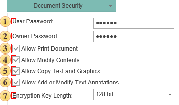

## Encryption

The **PDF** document can be encrypted to protect the content from illegal access. The user can set the following encryption patameters:

 In the field **User Password**, specify the password required to open the document. If you set the password, access to the opening file is limited and will occur only if you specify the correct password. If no password is specified, i.e. the field is left blank, then the file may be opened without restrictions.

 In the field **Owner Password**, specify the owner password to access the file. If you specify a password, access to the file operations, such as printing, copying etc will be available only after entering a password. If no password is specified, i.e., the field is left blank, the file operations will be available without restriction.

 The flag **Allow Print Document** enables/disables the restricted access to the printing operation. If this option is disabled, specifying the owner password is required to perform this operation. If enabled, then printing will be available for everyone who opens the document.

 The flag **Allow Modify Contents** enables/disables access to editing the text in the report. If this option is disabled, specifying the owner password is required to perform this operation. If enabled, then editing will be available for everyone who opens the document.

 The flag **Allow Copy Text and Graphics** enables/disables access to copying the information. If this option is disabled, specifying the owner password is required to perform this operation. If enabled, then copying will be available for everyone who opens the document.

 The flag **Allow Add or Modify Text Annotations** enables limited access to work with the annotations in the document. If this option is disabled, specifying the owner password is required to perform this operation. If enabled, then this operation will be available for everyone who opens the document.

 The flag **Encryption Key Length** allows selecting the length of the encryption key. The longer the length is, the more difficult is to decrypt the document, and, therefore, the safety of the document is higher.

According to the PDF specification, it is possible to set the access and two passwords: the public password and the owner's password. If there are no passwords and everything is allowed to do with the document, then the document is not encrypted. If even one password is set or access is not allowed, then the document is encrypted.

The public password allows opening and viewing documents, and also some actions are allowed:

edit document;

copy text and graphics from the document;

add and change commentaries;

print document.

The owner password provides access to the document, including password changing and access permission. If the owner's password is set, and the public password is not set, then, when opening a document, the password is not requested.

The PDF Reference defines both 40-bit, 128-bit, 256-bit encryption. By default 128-bit key is used.

256-bit key is more secure the 40-bit and 128-bit key. But is some countries the key length of encryption is limited.

**Quote from PDF Reference**

"A PDF document can be encrypted to protect its contents from unauthorized access. The encryption of data in a PDF file is based on the use of an encryption key computed by the security handler. Different security handlers can compute the key in a variety of ways, more or less cryptographically secure. In particular, PDF’s standard encryption handler limits the key to 5 bytes (40 bits) in length, in accordance with U.S. cryptographic export requirements in effect at the time of initial publication of the PDF 1.3 specification."
