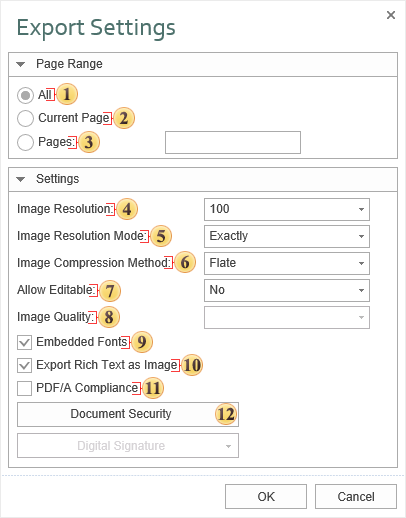

## PDF

**PDF** (Portable Document Format) – is a file format created by Adobe Systems for document exchange used to create electronic editions using the Adobe Acrobat package. The PDF format is a file text format that is used to publish documents on any platform and OS. The PDF document contains one or more pages. Each page may contain any components: text, graphic and illustrations, information, that provides navigation across the document.

> **Information**
>
> Export to PDF is based on the "Adobe Portable Document Format, Version 1.3, second edition", using some elements of latest format specifications.

To reduce the size of the PDF file uses a different compression methods. To compress text material used algorithm LZW ("Flate"). To compress graphics algorithms used JPEG or LZW. Algorithm JPEG - is a lossy compression is recommended for full-color illustrations and images. LZW algorithm - is lossless, it is recommended for illustrations and images with a small number of colors, such as graphs, charts, diagrams. To ensure the independence of the PDF font file contains a description for each font used in the document. The description includes the name, size, style and font settings. While viewing the document, if the font is described in the document is available, it is used. If not available, then replaced with a similar of the same size and other characteristics. Fonts can be embedded in the document. This greatly increases file size but ensures the correct display of the document on any computer.

 The checkbox **All** enables processing of all report pages.

 The checkbox **Current Page** enables processing only the current (selected) report page.

 The checkbox Pages has the field. This field specifies the number of pages to be processed. You can specify a single page, several pages (using a comma as the separator) and also specify a range by defining the start page and end page range separated with "-". For example, 1,3,5-12.

 The **Image Resolution** is used to change DPI (image property PPI (Pixels Per Inch)). The greater the number of pixels per inch is, the greater is the quality of the image. It should be noted that the value of this parameter affects the size of the finished file. The higher the value is, the greater is the size of the finished file.

 **Image Resolution Mode**. Depending on the values of this parameter, another resolution will be applied to the images:

* The **Exactly** value. All images after conversion will have a resolution that is set in the Resolution parameter of an image;

* The **No** More Than value. If the original resolution of an image is smaller than the specified in the Resolution parameter, the resolution of the image, after the conversion of the initial report, will correspond to the original one. If the original resolution is greater than the specified image Resolution, the image resolution will match the value of the Resolution parameter.

* The **Auto** value. The image, after the report rendering, will have the original resolution.

 The **Image Compression Method** allows defining the mode of image compression in the PDF file. The following modes are available:

JPEG - compression with loss;

Flate - compression without loss;

Simple - monochrome mode without dithering;

Ordered - monochrome image with dithering;

FloydSt. - the most precise monochrome mode with dithering.

 The option **Allow Editable** provides the ability to enable the mode in which, after exporting, it will be possible to modify components with the Editable property enabled. If No is set, then you can edit all components, unless it is not limited with safety parameters. If you select Yes then you can only edit components with the Editable property enabled.

> **Notice**
>
> Please note that restrictions on editing a Word document do not use encryption algorithms strong to cracking. Therefore, for the security of the document it is recommended to use a digital signature and security group.

 The **Image Quality** will be available only if you select the compression method JPEG. This option allows you to change the image quality. Keep in mind that if you change this option the size of the finished file will increase. The higher the quality is, the larger is the size of the finished file.

 The flag [Embedded Fonts](Embedded_Fonts.md) provides the ability to embed the font files into the created PDF file. If this option is enabled, then when you export a report, the files of all the fonts used in the report will be included in a PDF file, and fonts in the resulting file will be displayed correctly in any PDF viewer. If the property is disabled, then to display the file correctly all the fonts used in the report must be installed on the computer.

> **Information**
>
> If you enable this option, the file size may increase significantly. Especially when using a large number of fonts with different characters, for example Asian.

 The flag **Export Rich Text** as Image as Image enables/disables the conversion of the RTF text into the image. If the option is disabled, the Rich Text is decomposed into simpler primitives supported by the PDF format. The Rich Text with complex formatting (embedded images, tables) cannot always be converted correctly. In this case it is recommended to enable this option.

> **Information**
>
> When you enable this option, the file size may increase significantly.

 The flag **PDF/A** **Compliance** enables/disables support for standard long-term archiving of electronic documents. Compliance ensures that the document will have the same look in later versions of Adobe Acrobat. Enabling this option will also automatically include the options Embed Fonts and use Unicode.

 The [Document Security](Encryption.md).
