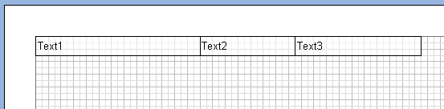
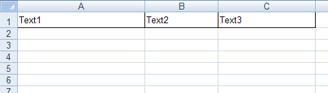
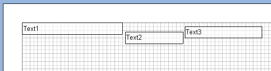
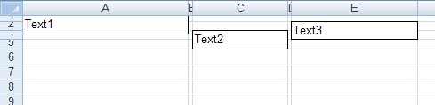
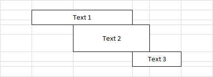
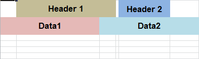
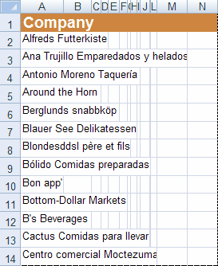
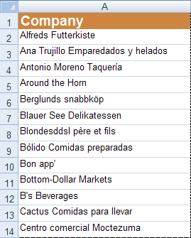

## How to Create Report for Export?

Many exports have the table mode. In this mode the whole report is converted into one table. Creating correct templates from the source code allows making the table look much better, decrease the size of the file, increase the speed of working with export. Therefore, when using the table mode of export it is important to follow some recommendations:

  * use the "Align to Grid" button of the designer. This will decrease the number of rows and columns in the output file; also this allows  avoiding very small gaps between components (some formats "do not like" table with very small columns);

  * put components on the data band at the same level (see the picture below); this will decrease the number of rows and columns in the output file;

For example: put three components in the designer. They should be placed without gaps. See the picture below:

As a result we get a simple table: one row and three columns.

Put three components as seen on the picture below.

As a result we get the Excel table: five rows and three cells (see the picture below). It is not convenient to edit such a table, the file size, time of export, and required memory are increased in some times.

The Excel sheet consists of cells that are formed at the intersection of rows and columns. All items (text, images, and other data) are arranged in cells and can take only an integer number of cells, both by width and height. Therefore, when the location of components, column width and row height is adjusted so that the margins of components coincide with the boundaries of columns/rows:

When you export a report, the column width and row height is calculated automatically, so as to place all components using as the smaller number of columns and rows as possible. If all components are arranged in columns/rows, the number of result columns/rows in the Excel file will match the number of columns/rows in the report components. If the template structure is more complex, for example components as headers are not placed in the columns, then additional columns/rows will be added the Excel file. Consider the following example:

As can be seen from the picture above the text components in the report template are located on different levels (rows) and not in the same columns. In this case, when you export a report to Excel, the result will be as follows:

As can be seen from the picture above you add more columns/rows.

* Do not use the Autowidth property. This property increases the number of columns in the exported file which is proportionally to number of records.

       

On the left picture the number of columns is 14, and this case is equal in number of data rows. If to disable the AutoWidth property then only one column will be output (see the right picture). Accordingly, the file size of a report, shown of the right picture, is some times smaller then the file of the report shown on the left picture and the export works faster.

> **Information**
>
> Number of columns is very important for the text editors. For example, MS Word allows no more than 64 columns; if the table has more than 64 columns then the document is output incorrectly.
