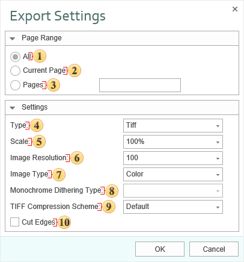

## Images

Export groups to graphic formats. All graphic formats can be divided in to types: bitmapped images and vector formats. Notice. On the current moment the export of a monochrome image is supported only to **BMP**, **GIF**, **PCX**, **PNG**, **TIFF**, **JPEG**, **EMF**, **SVG**, **SVGZ** format. So the **DitheringType** property works only for these exports.

 The checkbox **All** enables processing of all report pages.

 The checkbox **Current Page** enables processing only the current (selected) report page.

 The checkbox **Pages** has the field. This field specifies the number of pages to be processed. You can specify a single page, several pages (using a comma as the separator) and also specify a range by defining the start page and end page range separated with "-". For example, 1,3,5-12.

 The option **Type** provides the ability to determine a type of the file the report will be converted into.

 The option **Scale** allows you to increase/decrease the size of the report after export. It should also be taken into consideration that the smaller the scale is selected, the greater is the number of pixels per inch, and vice versa.

 The **Image Resolution** is used to change DPI (image property PPI (Pixels Per Inch)). The greater the number of pixels per inch is, the greater is the quality of the image. It should be noted that the value of this parameter affects the size of the finished file. The higher the value is, the greater is the size of the finished file.

 The option **Image Type** provides the ability to define the color scheme of the image.

* Color - an image after export will fully comply with the image in the report;

* Gray - an image after export will be gray.

* Monochrome - images will be strictly black and white. At the same time, it should be taken into consideration that monochrome images have three modes None, Ordered and FloydSt.

 The option **Monochrome Dithering** Type allows you to determine the type monochrome color mixing: None - no dithering, Ordered, FloydSt. - with dithering.

 The option **TIFF Compression Scheme** provides the ability to define a compression scheme for TIFF files.

 The checkbox **Cut Edges** provides the ability to display a report without page edges. If this is enabled, then when you export the report the page edges will be cut off. If this option is disabled, the report page will be displayed with the specified edges.

**BMP (Bitmap)** is an image file format used to store bitmap digital images. Initially the format could store only DDB (Device Dependent Bitmap) but today the BMP format stores device-independent rasters (DIB - Device Independent Bitmap). Color depth in this format varies from 1 to 48 bits per pixel. The maximal image size is 65535×65535 pixels. An image can be compressed but often is stored in uncompressed and has big size of the file. Many programs work with the BMP format because its support is integrated into Windows and OS/2.

**GIF (Graphics Interchange Format)** is a format to store graphic images. The GIF format can store compressed images, supports up to 8 bits per pixel, allowing a single image to reference a palette of up to 256 distinct colors. The GIF format was introduced by CompuServe in 1987 and has since come into widespread usage on the World Wide Web. In 1989 the format was modified (GIF89a), and transparency and animation was added. GIF uses LZW-compression. It allows reducing the file size without degrading the visual quality (logos, schemes). GIF is widely used in World Wide Web.

**PNG (Portable Network Graphics)** - is a bitmapped image format that employs lossless data compression. PNG was created to improve and replace more simple GIF format, and to replace more complicated TIFF format. In compare with the GIF format, the PNG format supports RGB images without color losses, supports alpha channels, and uses DEFLATE  (open algorithm of compression), that provides higher compression of multicolored files. The PNG format is usually used in World Wide Web and for graphic editing.

**TIFF (Tagged Image File Format)** is a file format for storing images. Originally, the TIFF format was created by the Aldus company in cooperation with Microsoft for using with PostScript. TIFF became popular for storing high-color-depth images, and is used for scanning, fax, to identify text, polygraphy and widely used in graphic applications. This format is flexible. It allows saving photos in different color spaces, and to use different algorithms of file compression, and to store a few images in one file.

**JPEG (Joint Photographic Experts Group)** is a format to store images. This format was created by C-Cube Microsystems as effective method to store high-color-depth images. For example, scanned photos with smooth variations of tone and color. Algorithm of compression with losing information is used in the JPEG format. This means that some visual quality is lost in the process and cannot be restored. It is necessary to get the highest coefficient of compression. Unpacked JPEG images are rarely have the same quality as original image but differences are insignificant. Compression ratio is usually set in conventional units, for example from 1 to 100. 100 is the best quality and 1 is the worst quality. The better quality the bigger file size.

**PCX** is a format to store images. This format was used in the ZSoft PC Paintbrush graphic editor (one of the most popular programs) for MS-DOS, text processors and Microsoft Word and Ventura Publisher. This is not so popular format analogue of BMP but is supported with such graphics editors as Adobe Photoshop, Corel Draw and others. The algorithm of compression is very quick but is not effective for compression of photos and other detailed computer graphics. Today this format is not displaced with formats which supports better compression. These formats are GIF, JPEG, and PNG.

**WMF (Windows MetaFile)** is a universal graphics file format on Microsoft Windows systems. This format was created by Microsoft and is an integral part of Windows because this file stores a list of function calls that have to be issued to the Windows graphics layer GDI in order to display an image on screen.

WMF is a 16-bit format. This format was introduced in Windows 3.0. A 32-bit version is called Enhanced Metafile EMF (Enhanced Metafile). The EMF format supports many new commands, supports work with the GDI+ library, and also is used as a graphic language for drivers of printers.

**SVG (Scalable Vector Graphics)** is an XML-based file format for describing two-dimensional vector graphics, both static and dynamic. The SVG specification is an open standard. SVG supports scripting and animation. The vector image is composed of a fixed set of shapes.

SVG allows three types of graphic objects:

Vector graphics;

Raster graphics;

Text.

The Images below shows the difference between exporting Bitmap format and SVG (vector) format.

Bitmap Formats

SVG Format

In addition to the **SVG** file format, there is a **compressed SVG** (with file extension SVGZ), which applies industry-standard, nonproprietary "gzip" compression (an open-source variant of Zip compression) to SVG files. Compressed SVG files are typically 50 to 80 percent smaller than SVG files. SVG files are compact and can be used to provide high-quality graphics on the Web.

Dither is an intentionally applied form of noise, when processing digit signals. It is used in most often surfaces in the fields of digital audio and video. The following image shows (from left to right) original image and the result of export to monochrome image. There are three modes of DitheringType: Ordered, FloydSteinberg, None.

> **Information**
>
> On the current moment the export of monochrome image is supported only to the PCX format. So the DitheringType property works only for this export.  Different images may look differently in these modes. The FloydSteinberg is the best mode to output an image but the file size is too big.
