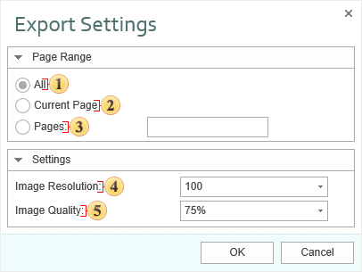

## ODS

**Open Document Spreadsheet (ODS)** is the opened format to store OpenOffice Calc spreadsheet documents, that is included into the OpenOffice.org package.

* **OpenOffice.org** is a free package of office applications developed as alternative to Microsoft Office. The OpenDocument is one of the first what started to support the opened format. it works on Microsoft Windows and UNIX-like systems: GNU/Linux, Mac OS X, FreeBSD, Solaris, Irix.

* **OpenDocument Format (ODF)** — an open document file format for storing and exchanging editable documents including text documents (such as notes, reports, and books), spreadsheets, drawings, databases, presentations. The format is based on the XML-format. The standard was jointly developed by public and various organizations and is available to all and can be used without restrictions.

* **OpenOffice Calc** is the table processor that is included into the OpenOffice and is a free software (LGPL license). Calc is similar to the Microsoft Excel spreadsheet and functionality of these processors is approximately equal. Calc allows you to saving documents to various formats, including Microsoft Excel, CSV, HTML, SXC, DBF, DIF, UOF, SLK, SDC. Starting with version OpenOffice 2.0, for document storage format by default OpenDocument Format, files are saved with the extension «. Ods». Starting with the OpenOffice version 2.0 for storing documents, by default, the OpenDocument Format is used. Files are stored with the «.ods» extension. Consider the basic parameters when exporting to ODS:

 The checkbox **All** enables processing of all report pages.

 The checkbox **Current Page** enables processing only the current (selected) report page.

 The checkbox **Pages** has the field. This field specifies the number of pages to be processed. You can specify a single page, several pages (using a comma as the separator) and also specify a range by defining the start page and end page range separated with "-". For example, 1,3,5-12.

 The **Image Resolution** is used to change DPI (image property PPI (Pixels Per Inch)). The greater the number of pixels per inch is, the greater is the quality of the image. It should be noted that the value of this parameter affects the size of the finished file. The higher the value is, the greater is the size of the finished file.

 The **Image Quality** allows changing the image quality. Keep in mind that if you change this option the size of the finished file will increase. The higher the quality is, the larger is the size of the finished file.
