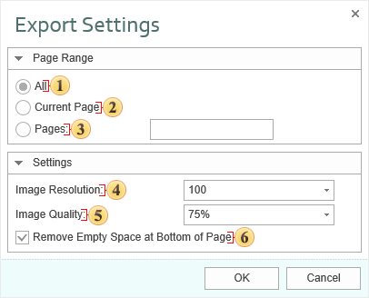

## ODT

**Open Document Text (ODT)** is the open document for storing documents of the OpenOffice Writer, which is included into the OpenOffice.org package. OpenOffice.org is the open package of office applications created as alternative to Microsoft Office. OpenOffice.org was one of the first what supported the new open OpenDocument. Works on Microsoft Windows and UNIX systems: GNU/Linux, Mac OS X, FreeBSD, Solaris, Irix. OpenDocument Format (ODF) is the open file format for storing office documents, including text documents, spreadsheets, images, data bases, presentations. This format is based on the XML format.

OpenOffice Writer is the text processor and visual HTML editor, included into the OpenOffice. It is open software (LGPL license). Writer is similar to Microsoft Word and has approximately the same functionality. Writer allows saving documents in different formats including Microsoft Word, RTF, XHTML, and OASIS Open Document Format. Starting with the OpenOffice version 2.0, the OpenDocument Format is the default format for saving documents. File have the «.odt» extension. When exporting the report is converted into a single table. The document is easily editable but some objects can be changed.

 The checkbox **All** enables processing of all report pages.

 The checkbox **Current Page** enables processing only the current (selected) report page.

 The checkbox **Pages** has the field. This field specifies the number of pages to be processed. You can specify a single page, several pages (using a comma as the separator) and also specify a range by defining the start page and end page range separated with "-". For example, 1,3,5-12.

 The **Image Resolution** is used to change DPI (image property PPI (Pixels Per Inch)). The greater the number of pixels per inch is, the greater is the quality of the image. It should be noted that the value of this parameter affects the size of the finished file. The higher the value is, the greater is the size of the finished file.

 The **Image Quality** allows changing the image quality. Keep in mind that if you change this option the size of the finished file will increase. The higher the quality is, the larger is the size of the finished file.

 The checkbox **Use Page Headers and Footers** is used to define the Page Header and Footer as the header and footer of the Word document. If this option is not set, then, after exporting, page header and footer will be a table cell or an individual frame. In case of editing a report they may change its location. If this option is enabled, the data bands will be output as objects a header and footer in the Word document.

> **Information**
>
> If the checkbox **Use Page Headers and Footers** is on, it should be taken into consideration that, in this case, the height of the lines will be minimum allowable.

 The checkbox **Remove Empty Space at Bottom of the Page** is used to display data one after the other while minimizing empty space at the bottom of the page. If this option is enabled, then, if empty space is available, the part of data from the next page will be moved to the empty space. If this option is disabled, the empty space is ignored and the report will be displayed in the viewer or in the tab Preview.
