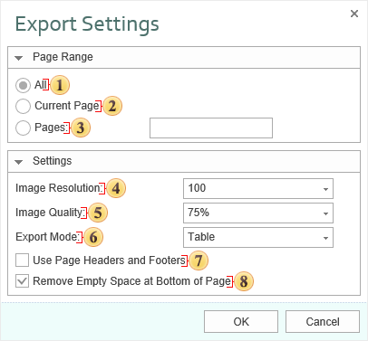

## RTF

**Rich Text Format (RTF)** is a free document file format developed by Microsoft for cross-platform document interchange. The first version of the RTF standard appeared in 1987. Since that time format specification was changed and added. RTF-documents are supported by many text editors. Export options in RTF:

 The checkbox **All** enables processing of all report pages.

 The checkbox **Current Page** enables processing only the current (selected) report page.

 The checkbox **Pages** has the field. This field specifies the number of pages to be processed. You can specify a single page, several pages (using a comma as the separator) and also specify a range by defining the start page and end page range separated with "-". For example, 1,3,5-12.

 The **Image Resolution** is used to change DPI (image property PPI (Pixels Per Inch)). The greater the number of pixels per inch is, the greater is the quality of the image. It should be noted that the value of this parameter affects the size of the finished file. The higher the value is, the greater is the size of the finished file.

 The **Image Quality** allows changing the image quality. Keep in mind that if you change this option the size of the finished file will increase. The higher the quality is, the larger is the size of the finished file.

 The checkbox **Export Mode** provides the ability to define the presentation of the report data after export. If you select Table, then, after exporting, the entire report will look like a table, where each report component is a table cell. All components are located in different cells with relations created between them. If the Frame is selected, then, after export, each component will be a single frame, but without relations between them.

 The checkbox **Use Page Headers and Footers** is used to define the Page Header and Footer as the header and footer of the Word document. If this option is not set, then, after exporting, page header and footer will be a table cell or an individual frame. In case of editing a report they may change its location. If this option is enabled, the data bands will be output as objects a header and footer in the Word document.

> **Information**
>
> If the checkbox **Use Page Headers and Footers** is on, it should be taken into consideration that, in this case, the height of the lines will be minimum allowable.

 The checkbox **Remove Empty Space at Bottom of the Page** is used to display data one after the other while minimizing empty space at the bottom of the page. If this option is enabled, then, if empty space is available, the part of data from the next page will be moved to the empty space. If this option is disabled, the empty space is ignored and the report will be displayed in the viewer or in the tab Preview.

The export to the **RTF** format has 2 basic modes:

**Frames** - in this mode all objects of a report are converted to the frame rtf-objects; the report is converted precisely, but it is difficult to edit such a document.

**Table** - in this mode all objects of a report are converted to the single table; when converting, objects can be changed, but this document can be easily edited, and, therefore, this mode is more frequently used and this mode is the default mode of this export.

Also there are 2 modes of operation, which are obsolete and retained for compatibility:

**WinWord** - similar to Frames, but all the objects passed as "frame" objects of MS-Word.

**TabbedText** - the same as the export the Text format, the position of a text is set using blank spaces and tabulations.

In this mode the whole report is converted into a single table. When exporting the report is converted into a single table. The document is easily editable but some objects can be changed.

Depending on the value of the **Use Page Headers and Footers** property the report is exported as follow:

value is set to **false** - the report is exported "as is" and will look the same as in preview;

value is set to **true** - the report is additionally processed, all changes are described in the text below.

The list of document changes:

**PageHeaders** and **PageFooters** are exported as MS-Word objects. So they are cut from the table and other bands are converted into a single page. It is very convenient because it is easy to correct the document, for example, to put or edit text in cells, change the cell size; all data are moved, and headers and footers of a page stay on their place. (Notice: the header and the footer are exported from the first page of a report, others are ignored; in addition the improvement was done: now the header is searched on the second page; if the property PrintOn of this header is set to **ExceptFirstPage**, then everything is exported correctly (using the RTF tags) - the header will not be output on the first page.

If the Header of the **PrintOnAllPages** property is enabled, then it is exported as the table header, and is correctly output on each page.

The height or rows in not exported (the "not set" mode; by default the "precise" mode is set).

If the **Tag** field is not empty, then the content of the Tag field is exported. The Text field is not exported. The following expression can be used to change MS-Word commands:

| **Tags** | **Description** |
| --- | --- |
| #PageNumber# | The number of the current page (PAGE) |
| #TotalPageCount# | Total number of pages in the document (NUMPAGES) |
| #PageRef Bookmark# | The number of pages on what the bookmark is placed (PAGEREF) |

For example, the following expression can be written in the **Tag** field:

`Page #PageNumber# of #TotalPageCount#`

When exporting, **#PageNumber#** and **#TotalPageCount#** will be substituted on the "Page number" field and "Total Page" field. And they will be automatically changed.

The following string-commands can be written in the **Tag** field:

| **Commands** | **Description** |
| --- | --- |
| rtfparagraph | The TextBox, RichTextBox and Image content is output as simple text, in the table break; |
| rtfnewpage | The page break is put before the text box. |

Also it is possible to export a separate sheets of a template to separate sections of the document with the headers/footers. To do this, use the ExcelSheet property. in this case all pages of a report with the same value of the ExcelSheet property are combined in groups, then each group is exported as a separate section of the document with its headers/footers. By default, this property is not filled, and the report is exported as a single partition.

MS-Word: if to set top and bottom margin of one of cells in the table row, the same margin will be set in all cells of the row. Therefore, if to set the top and bottom margins of the text box, then, after exporting, the same margin will be set for the row of the table and the text will be moved. In OpenOffice this works without problems.

The RTF format is based on the RTF specification version 1.4 from 9/1995. The RTF files can be opened in Microsoft Word starting with the 97 (Office 97) version. In Microsoft Word 95 the RTF will have the following limitation:

does not support vertical alignment in cells;

does not some parameters of a page;

some colors and not shown correctly.
