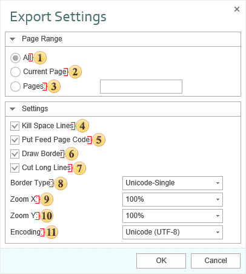

## TXT

**Text file (TXT)** is a kind of computer file that is structured as a sequence of lines. A text file exists within a computer file system. The end of a text file is often denoted by placing one or more special characters, known as an end-of-file marker, after the last line in a text file. Text files are commonly used for storage of information. Export options in TXT:

 The checkbox **All** enables processing of all report pages.

 The checkbox **Current Page** enables processing only the current (selected) report page.

 The checkbox **Pages** has the field. This field specifies the number of pages to be processed. You can specify a single page, several pages (using a comma as the separator) and also specify a range by defining the start page and end page range separated with "-". For example, 1,3,5-12.

 The checkbox **Kill Space Lines** provides the ability to delete blank lines in the document. If there are blank lines in a report, setting this flag will make the report more compact, but it should be taken into consideration that removing those lines can disrupt the formatting of other report elements.

 The checkbox **Put Feed Page Code** provides an opportunity to select the end of the page with a special character.

 The checkbox **Draw Border** enables/disables drawing borders of components with graphic symbols.

 The checkbox **Cut Long Lines** provides the ability to cut lines by the margins of the component. If this option is enabled, the line length is limited to the margins of the component. If this option is disabled, the line will be displayed in its full length.

 The option **Border Type** is used to enable a certain type of borders of components. The options are:

* Simple - drawing the borders of components with characters +, -, |.

* Unicode-Single - drawing the borders of components with box-drawing characters.

* Unicode-Double - drawing the borders of components with double box-drawing characters.

 The option **Zoom X** provides the ability to set the report zoom horizontally.

 The option **Zoom Y** provides the ability to set the report zoom vertically.

 The option **Encoding** provides the ability to set the text encoding of the report after exporting.

The border in the text mode can be drawn using simple symbols or using pseudographics. Using the **BorderType** property it is possible to choose the mode of border drawing. It may have the following modes:

Simple - drawing a border using simple symbols such as  "+", "-", and "|";

UnicodeSingle - drawing a border using the symbols of  pseudographics; symbols of solid border are used;

UnicodeDouble - drawing a border using  the symbols of  pseudographics; symbols of double border are used.

When exporting to the text format, all coordinates and sizes of objects are recalculated to get the text appearance the same as it is in a report. You can control the conversion, by changing the zoom coefficients of **ZoomX** and **ZoomY**. The width of the columns of the output text is proportional to the width of the initial report. If you want to change the column width, it is possible to use the following methods:

change the width of a column: it is necessary to specify the column width in characters in the Tag text box, the width will be set only for those lines which contain this text box;

column width can be set globally via the **ColumnWidths** static property; in this case, the width of the columns is indicated starting from the left column, through the separator (a semicolon), for example, "10, 12, 45, 10, 10, 5, 20, 50 "; zero width of columns is ignored.

The old/new export mode is set using the **UseOldExportMode** property. The new mode is created on the base of the **StiMatrix**: if the Word Wrap is enabled and a text cannot be placed in a cell then the cell height is increased automatically. By default the new mode is enabled.
