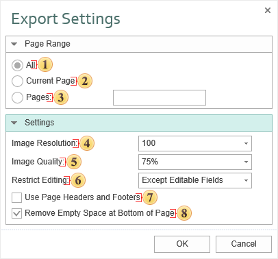

## Word 2007/2010

**Microsoft Word** is a text processing software produces by Microsoft. It is a component of the Microsoft Office system. The first version was released for  IBM PC's running DOS in 1983. Later there was a release for Apple Macintosh (1984), SCO UNIX, and Microsoft Windows (1989). Microsoft Word is the most popular text processors. Starting with first versions MS Word could write files in binary code with the «.doc» extension. The Word specification was secret and only in 2008 was published. The latest version of Word 2007/2010 "uses by default" the XML based format: Microsoft Office Open XML. For a new format the **«.docx»** file extension is used. This format is a zip-archive that contains a text as XML, graphics, and other data. When exporting, a report is converted into one table. Such a document is easy to edit. Export options in Word

 The checkbox **All** enables processing of all report pages.

 The checkbox **Current Page** enables processing only the current (selected) report page.

 The checkbox **Pages** has the field. This field specifies the number of pages to be processed. You can specify a single page, several pages (using a comma as the separator) and also specify a range by defining the start page and end page range separated with "-". For example, 1,3,5-12.

 The **Image Resolution** is used to change DPI (image property PPI (Pixels Per Inch)). The greater the number of pixels per inch is, the greater is the quality of the image. It should be noted that the value of this parameter affects the size of the finished file. The higher the value is, the greater is the size of the finished file.

 The **Image Quality** allows changing the image quality. Remember that if you change this option the size of the finished file will increase. The higher the quality is, the larger is the size of the finished file.

 The parameter Restrict Editing provides the ability to restrict editing the Word document. The available modes are:
* **No** – without editing;
* **Yes**- editing is not allowed;
* **Except Editable Fields** - editing is allowed only for editable fields in the report. In this case, the Editable property of components must be set to true.

> **Information**
>
> Restrictions on editing a Word document do not use encryption algorithms resistant to cracking. Therefore, we recommend using the export to PDF, if you want to get a document with restrictions on editing, and a good level of protection.

 The checkbox **Use Page Headers and Footers** is used to define the Page Header and Footer as the header and footer of the Word document. If this option is enabled, THESE bands will be output as a header and footer objects in the Word document.  If to attach XML and XSD files to the report, then a data source will be generated on the base of them. This source can be used when creating reports.

> **Information**
>
> If the checkbox **Use Page Headers and Footers** is on, it should be taken into consideration that, in this case, the height of the lines will be minimum allowable.

 The checkbox Remove Empty Space at Bottom of the Page is used to display data one after the other while minimizing empty space at the bottom of the page. If this option is enabled, then, if empty space is available, the part of data from the next page will be moved to the empty space. If this option is disabled, the empty space is ignored and the report will be displayed in the viewer or in the tab Preview.

Depending on the value of the **Use Page Headers and Footers** property a report is exported in the following way:

the value is false - a report is exported "as is" and looks as in preview;

the value is true - a report is additionally processed. All changes are described below.

The list of changes of the document:

PageHeaders and PageFooters are exported as MS-Word objects. So they are cut from a table and all other bands are exported as one table. It is very convenient, if it is necessary to elaborate the document (add rows or edit a text in cells, change cell size); in this case all data are moved but headers and footers stay on their place. (Notice: a header and a footer of the first page are taken, others are ignored).

Row height is not exported (the "not set" mode; by default - the "precise" mode).

If the **Tag** is not empty then the content of the Tag property is exported. The Text field is not exported. Also the string may contain the following expressions, which are changed on MS-Word commands:

Commands

Action

#PageNumber#

The number of the current page (PAGE)

#TotalPageCount#

Total number of pages in a document (NUMPAGES)

For example, in the Tag property the following expression can be written:

`Page #PageNumber# of #TotalPageCount#`

When exporting **#PageNumber#** and **#TotalPageCount#** will be replaced on "PageNumber" field and "TotalPageCount" field and will be automatically changed together with text.
