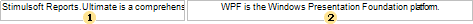
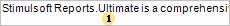
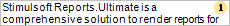
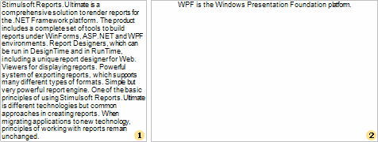
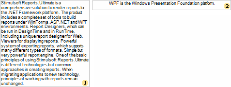

## HTML

**HTML** (HyperText Markup Language) is the predominant markup language for Web pages. The majority of web pages are created using the HTML language. The HTML language is interpreted by browser and shown as a document. HTML is a tag language of the document layout. It provides a means to describe the structure of text-based information in a document by denoting certain text as links, headings, paragraphs, lists, etc. Elements are the basic structure for HTML markup. Elements have two basic properties: attributes and content. Each attribute and each element's content has certain restrictions that must be followed for a HTML document to be considered valid. An element usually has a start tag (e.g. **&lt;element-name&gt;**) and an end tag (e.g. **&lt;/element-name&gt;**).

There are three mode of export to HTML:

Div - in this mode all objects of a report are converted to the div block element; the report is converted precisely, except for vertical text alignment;

Span is the same as the Div mode but the span element is used;

Table - in this mode all objects of a report are converted to the table block element; in this mode the vertical text alignment is correct but, if the WordWrap is disabled then the problem may occur with long lines of text.

Also it is possible to specify how to export images of a document. Images with transparency can be saved to the PNG format. It is important to remember that some browsers (for example Internet Explorer 6) do not support images with transparency.

The following minimal web-browsers versions are required for correct HTML export:

Internet Explorer 6.0 and higher;

FireFox 1.5 and higher;

Opera 7.5 and higher.

When exporting reports to the **HTML** format, it is necessary to take the following features of this format into consideration:

if a text does not fit a table cell horizontally, then a browser automatically carries a text to the next page;

if a text does not fit a table cell vertically, then a browser automatically increases height of a table cell.

Such a behavior of a text can be obtained in the Net and WPF viewers (Win-viewers) by setting **WordWrap** and **CanGrow** properties of a text component to true. In the HTML format (and in the Web viewer correspondingly), no matter what is the value of these two properties, the text component will be shown the same way. For example, put 2 text components on a report template. Insert long text to the first component and a short one to the second. Set **WordWrap** and **CanGrow** properties to false. The picture below shows a report template:

After rendering a report in the Win-viewer, a report will look like on a picture below:

As seen on the picture, a text in the first text component did not fit and was cut, in the second text component the text fits a text component and shown without changes. Now set the WordWrap property to true for both components. After rendering, a report will look in the Win viewer like on the picture below:

As seen on the picture, a text in the first text component is wrapped to the second row. But the component is not grown by height, so the text does not fit this component and was cut. In the second component the text fit this component and shown without changes. In both ways the text in the HTML format in the Web will look the following way:

If to set the Can Grow properties of these texts components to true, then the report will look the same in the Win viewer and Web viewer:

