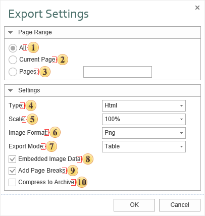

## Web Documents

There are two formats [HTML](HTML.md) (HyperText Markup Language), [HTML5](HTML5.md) and [MHTML](MHT.md) (MIME HTML) are described in this chapter. The first and second formats are used for web page layout. The second format is a web page archive format used to bind resources together with the HTML code into a single file.

 The checkbox All enables processing of all report pages.

 The checkbox Current Page enables processing only the current (selected) report page.

 The checkbox Pages has the field. This field specifies the number of pages to be processed. You can specify a single page, several pages (using a comma as the separator) and also specify a range by defining the start page and end page range separated with "-". For example, 1,3,5-12.

 The option Type provides the ability to determine a type of the file the report will be converted into.

> **Information**
>
> If **Html5** is selected the following additional options are available:
>
>   * **Continuous Page**, which provides the ability to set the location of pages in the report as a vertical strip;
>
>   * The **Image Resolution** is used to change DPI (image property PPI (Pixels Per Inch)). The greater the number of pixels per inch is, the greater is the quality of the image. It should be noted that the value of this parameter affects the size of the finished file. The higher the value is, the greater is the size of the finished file;
>
>   * The **Image Quality** allows changing the image quality. Keep in mind that if you change this option the size of the finished file will increase. The higher the quality is, the larger is the size of the finished file.

 The option **Scale** provides the ability to determine the size (scale) of report pages and items of the report after the export.

 With the **Image Format** it is possible to specify the format of images, which will be transformed into the image of the report.

 The option **Export Mode** provides the ability to determine the markup for the HTML page. The page layout is possible using tags div, span or table.

 The flag **Embedded Image Data** provides the ability to embed images directly into the HTML file. In this case, it is necessary to consider that the correct displaying of this file depends on the browser being used. Not all browsers support the option to view the HTML file with embedded pictures.

 The flag **Add Page Breaks** enables/disables the visual separator of report pages. If, for example, a few pages of the report are exported to a HTML page, it is not always possible to identify the beginning of the report page. To do this, you should select this option, then it will be, the beginning of the report page will be indicated by the appropriate delimiter.

 The flag **Compress to Archive** provides the ability, when exporting to HTML, to get the zip file after conversion. If this flag is on, the report processing occurs first, and then all the files and folders will be packed in a zip archive.
