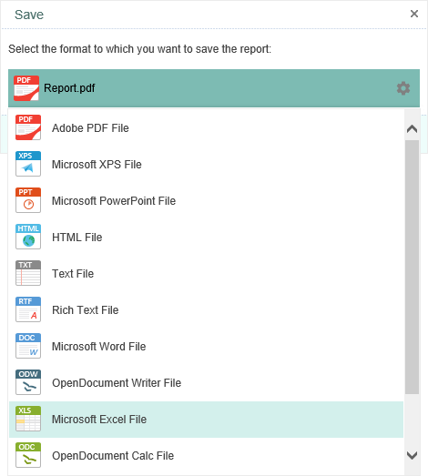

## Exports

> **YouTube**
>
> Watch our video tutorials on [export reports](https://www.youtube.com/watch?v=0B7YdTdoGPY&index=6&list=PL-72PPAq-3SVXiCXMHVtOHlODCos0wpbA). Subscribe to the [Stimulsoft channel](https://www.youtube.com/user/StimulsoftVideos) and be the first who watches new video tutorials. Leave your questions and suggestions in the comments to the video.

This section describes principles of saving rendered reports to different formats, basic characteristics of methods for export, export optimization guidelines data structure which are used in export methods. Stimulsoft Reports.Server supports great many export formats to save rendered reports. Many clients think that there are too many formats. But when you need to get file of definite format type, write only one string of code and the format is not PDF, HTML or RTF, only Stimulsoft Reports may help. We do not think that too many export formats in our report generator is disadvantage and continually work on adding new formats. The more exports the better, as they say.

