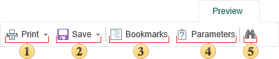
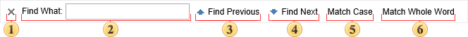

## Toolbar

The main toolbar locates commands to control the report. Below is the structure of the toolbar with the description of each command:

 Prints a report. After activation of this command the printing dialog with parameters of printing will be displayed.

 [Saves the rendered report](Exports/index.md) to other file formats.

 Opens the dialog for changing basic parameters of the rendered report.

 Shows/hides the tree of bookmarks. If there are no bookmarks in the rendered report then the viewer will automatically hide the tree of bookmarks. If there are bookmarks in a report, then the viewer will automatically show the tree of bookmarks.

 Enable the search panel.

* **Status Bar**

On the picture below you can see the toolbar that is used for report navigation

 Set the first page of a report as the current page.

 Set the previous page of a report as the current one.

 Show the number of the current page and the number of pages in a report.

 Set the next page of a report as the current one.

 Set the last page of a report as the current page.

 Change zoom of the report to fit the page width to the screen width.

 Change zoom of the report to display only one full page. More than one page by the width can be output.

 Set the report zoom.

* **Search Panel**

The search panel is used to search some text in the report. On the main toolbar this option can be enabled by clicking the binocular icon. All controls for search are placed on a single panel.

 Close the search panel.

 The field to put a text that should be found.

 The button Find Previous to run search.

 The button Find Next to run search.

 If the flag is set, then search will be repeated considering the case.

 If the flag is set, then search will be done considering the whole word.
