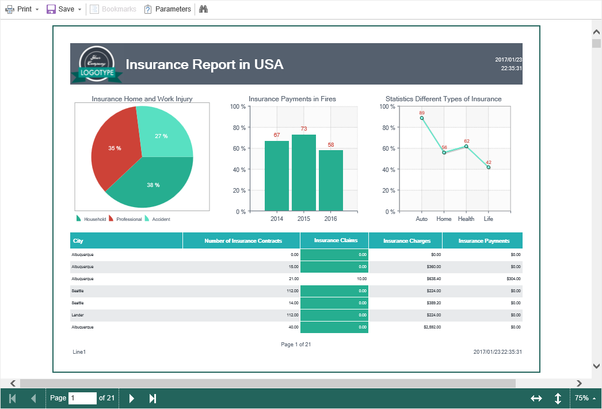

## Report Viewer

**Stimulsoft Reports.Server** has a report viewer that is used to view, print, export, send reports by e-mail. The report viewer can be found on a separate tab that opens when the action is associated with **report** items, for example, by the action of **View**. The picture below shows the tab **Viewer** with the report displayed in it:

